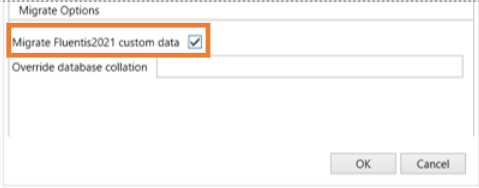

# Custom Environment Migration From 2021 to 2023  
## How does it Work?  

In presenza di *personalizzazioni* sull'ambiente oggetto di migrazione, occorre osservare che i prerequisiti e la procedura sono le ***stesse*** dello scenario denominato *Standard Environment Migration From 2021 to 2023*, eccezion fatta per la check-box '***Migrate Fluentis2021 Custom Data***' così come in figura sottostante.  
  
Tanto premesso, si rimanda alla seguente pagina web [***Link***](docs/2021/home/StandardEnvironmentMigrationFrom2021to2023.md), che tratta lo scenario *'Standard Environment Migration From 2021 to 2023'*. L'unica particolarità di questo scenario riguarda  l'apposito di apposito flag nella check-box denominata '*Migrate Fluentis2021 custom data*'

È importante notare che, in presenza di personalizzazioni nell'ambiente di *origine*, la loro replica nell'ambiente di *destinazione* dipenderà dal tipo di personalizzazione.  

Nel seguito di questa documentazione presenteremo, per ciascuna personalizzazione, il suo comportamento a seguito della migrazione.  
Si rimanda pertanto a questa pagina web [***Link***](docs/2021/home/Personalizzazioni.md​).   

