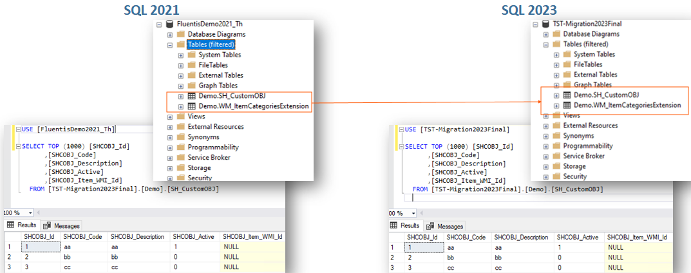

## Personalizzazioni
### Overview
Le personalizzazioni che prevedono la scrittura di codice custom oppure la produzione di nuove dll vengono migrate automaticamente.  
La <ins> migrazione </ins> andrà a creare solo la base dati di destinazione, e perciò le dll custom andranno rigenerate eseguendo una <ins> ***compilazione*** </ins> dell'ambiente di destinazione il quale dovrà essere necessariamente un ambiente di sviluppo.

La migrazione quindi andrà a replicare nel database di destinazione:
* La struttura del DB con i relativi dati.
* Gli elementi lato server con classi ed algoritmi.
* Gli elementi lato client come form e widget.  

Le tabelle che hanno un prefisso cliente <ins> custom </ins> vengono riportate dal database di **origine** a quello di **destinazione** nell'istanza MSSQL indicata.     

### Extension & Custom Objects
A livello di database Arm le tabelle custom, le estensioni di oggetti standard migrano correttamente.   

### Algoritmi Custom
Gli algoritmi custom vengono migrati correttamente, sia a livello di parametrizzazione che a livello di codice.  

<ins> ## Caution </ins>

In presenza di particolari personalizzazioni, operate dall'utente nell'ambiente di origine mediante la scrittura di codice custom, potrebbero verificarsi delle anomalie a seguito della migrazione in ambien
