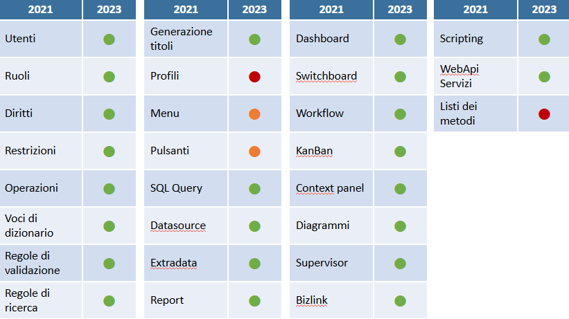
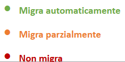

# Test Migrated Custom 2021 to 2023
Come anticipato in precedenza, nella pagina web [***Link***](docs/2021/home/CustomEnvironmentMigrationFrom2021To2023.md) si spiega che il comportamento relativo alla migrazione può variare a seconda del tipo di personalizzazione.  

## Overview
Di seguito si riporta uno scherma panoramico il quale riassume l'esito della migrazione rispetto alle varie tipologie di personalizzazioni.  

  
        *Legenda*

### Utenti, Ruoli, Diritti, Restrizioni, Operazioni
Le parametrizzazioni relative a questi elementi vengono automaticamente migrate da Fluentis2021 a Fluentis2023.      

### Voci di dizionario, Regole di validazione, Regole di ricerca e generazione titoli  
Le parametrizzazioni relative a questi elementi vengono automaticamente migrate da Fluentis2021 a Fluentis2023.  

### Profili
I profili non possono essere migrati da Fluentis 2021 a Fluentis 2023 e dovranno essere ricreati manualmente sull'ambiente di destinazione.  
Non rimane traccia dei vecchi profili nell'ambiente di destinazione.  

### Ribbon menu e pulsanti  
I ribbon menu e il pulsanti custom creati in Fluentis 2021 migrano correttamente; tuttavia, è fortemente raccomandato procedere ad un ricalcolo del Ribbon Menu manuale. Per maggiori approfondimenti si faccia riferimento alla documentazione di Linea di Arm.  

### SQL Query e Datasource  
Le SQL Query ed i Datasource migrano correttamente in Fluentis 2023.  

### Extra-Data
Per quanto concerne gli* Extra-data*, che possono essere basati su n. 3 tipologie diverse, e più nello specifico:  
* Extra-data semplici.  
* Extra-data basati su oggetti.  
* Extra-data basati su un datasource.

A seconda della tipologia di Extra-data il comportamento circa la migrazione è distinto.  

