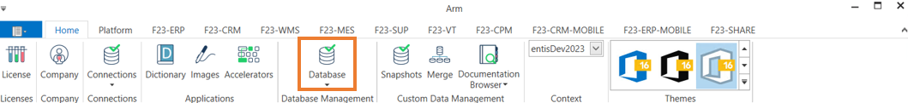
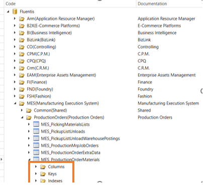
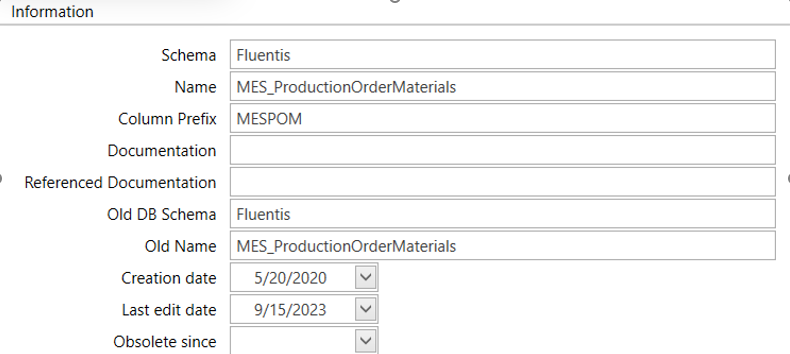
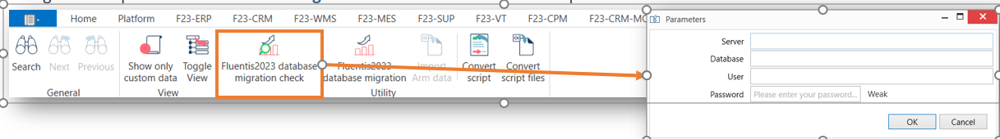

# Standard Environment Migration From 2021 to 2023  

## Prerequisites

Come già accennato in precedenza nell'**[Overview](/docs/intro)**, della presente documentazione, i requisiti indispensabili per poter eseguire correttamente la migrazione da Fluentis 2021 a Fluentis 2023, sono i seguenti:  
* disporre di un ambiente '**ponte**' Fluentis 2023 completamente standard che fungerà da template per la migrazione che deve essere aggiornato all'ultima patch e release.  
* disporre dell'ambiente da **migrare** (cosiddetto ambiente d'origine) che deve essere aggiornato all'ultima patch e release.   
* disporre di un'istanza del motore database MSSQL caricata su server basato su distribuzione Linux oppure su s.o. Windows. L'istanza del motore database MSSQL può essere la medesima che ospita il database origine oppure essere distinta, a condizione che sia inclusa nella medesima rete aziendale.  

Accediamo ad **Arm 2023**, e dal menu **Home** selezioniamo la voce **Database** così come mostrato in figura.  

Una volta entrati dentro, la **Form** si presenta così come segue:   
## Ribbon Menu
  
Il Ribbon menu della form consente all'utente di effettuare determinate operazioni, in particolare:
* *Search*: consente all'utente di eseguire una **ricerca** mirata di gruppi, tabelle e colonne.  
* *Next*: /
* *Previous*: /
* *Show Only Custom Data*:
* *toggle View*: permette di effettuare uno switch di view tra elementi standard ed elementi custom.
* *Fluentis2023 database migration check*: permette di eseguire un controllo preliminare circa la base dati da migrare.   
* *Fluentis2023 database migration*: permette di eseguire la migrazione vera e propria specificando base dati d'origine e base dati di destinazione.  
* *Import Arm Data*: /
* *Convert Script*: /
* *Convert Script files*: /

## Standard Filter
  
Il filtro standard è composto da n. 1 input-box.   
* Search Code: che permette di specificare il nome di una Tabella per poterla ricercare.

## Result Widget
  

Il **Result Widget** costituisce il corpo centrale della form e mostra le informazioni riguardanti gli elementi raggruppati per area funzionale.   
Tali elementi sono a loro volta costituiti da una **gerarchia di elementi**, e più precisamente:
* **Tabelle**.
    * **Colonne**.
        * **Chiavi**.
            * **Indici**.

Selezionando un determinato **Elemento** della gerarchia di cui sopra, è possibile prendere visione delle relative informazioni di base della Tabella, come ad esempio:  
* Schema del Database.  
* Nome della tabella.  
* Prefisso delle colonne.  
* Data di creazione.  
* Data di ultima modifica.      
   

## How does it Work?
### Migration Check  

Prima di procedere con la **Migrazione** vera e propria della base dati di Fluentis è fortemente raccomandato procedere ad una **validazione preliminare** della medesima che metterà in evidenza eventuali criticità nonché cause ostative allo step successivo.  

Cliccando quindi sul pulsante '**Fluentis2023 database migration check**' si aprirà un pop-up che prevede l'inserimento di alcuni dati obbligatori, quali:  
* Server: Si tratta dell'indirizzo IP pubblico del server dell'istanza del motore database **MSSQL** oppure del suo hostname nel caso di presenza di server DNS opportunamente configurato.  
* Database: Si tratta del nome del database caricato sull'istanza del motore database MSSQL.  
* User: Si tratta dell'utente di accesso alla base dati; è **obbligatorio** utilizzare l'utente **sa**, *SuperAdmin*.
* Password: Si tratta della password relativa all'utente di cui al punto che precede.  

