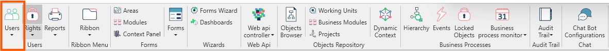

In questa sezione vengono elencate le operazioni relative alla gestione degli utenti e delle relative autorizzazioni per ogni applicazione.

##  Griglia utenti

La form Utenti è una filter form composta da un filtro, una griglia dei risultati e una ribbon bar con i pulsanti per le azioni da compiere.

| 
***Griglia dei risultati*** 
 | Descrizione |
| -----------------------------------------|-------------------------------------------------------------|            
| _Nome_                |   nome e cognome dell’utente                                                              |
| _Tipo Autenticazione_ |   modalità di autenticazione                    |
| _Nome login_          |   login di accesso                                                                        |
| _Dominio_             |   nome del dominio di autenticazione dell’utente o nome del workgroup del server di ARM   |
| _Email_               |   email dell’utente                                                                       |
| _Descrizione_         |   eventuale descrizione dell’utente                                                       |
|_Lingua_               |   lingua predefinita per l’utente                                                         |
|_Tipo Licenza_         |   tipo di licenza assegnata all'utente                                                    |
|_Disabilitato_         |   indica se l'utente è disabilitato                                                       |

| 
***Azioni*** 
 | Descrizione |
| -----------------------------------------|-------------------------------------------------------------|            
| _Ricerca_                |   per applicare le regole di filtro e caricare la lista degli utenti disponibili                                                              |
| _Nuovo_                  |   per procedere alla creazione manuale di un utente                                                                                           |
|_Modifica_                |   per modificare i dettagli di un utente selezionato, permette di aprire in modalità RW la form di dettaglio del singolo utente               |
|_Visualizza_              |   per aprire in modalità RO la form di dettagli del singolo utente e visualizzare i dettagli                                                  |
|_Elimina_                 |   per eliminare l’utente selezionato                                                                                                          |

**Nuovo / Visualizza / Modifica** portano all’apertura della stessa Object Form di dettaglio Utente, con **Nuovo** la form sarà in modalità RW e con tutti i campi da popolare, con **Modifica** la form sarà RW e tutti i campi saranno modificabili, con **Visualizza** sarà in modalità RO per la sola consultazione.

## Azioni ribbon form di dettaglio

| 
***Azioni*** 
 | Descrizione |
| -----------------------------------------|-------------------------------------------------------------|            
| _Salva_                  |    per salvare le modifiche fatte                                                              |
| _Aggiorna la licenza_    |   da utilizzare nel momento in cui si modificano informazioni relative alla  licenza nel secondo tab                                                         |
|_Percorso predefinito per Outlook_                |                  |

## Testata

La form **Utente** è una object form composta da una serie di campi di testata e 3 Tab con le informazioni di dettaglio e una ribbon bar con le possibili azioni dell'utente.

**Campi di testata**
* **Riquadro Immagine:** utilizzato per l’impostazione e visualizzazione di un’ immagine associata all’utente.
* **Nome:** nome dell'utente che si sta creando/modificando.		
* **Nome login:** nome utilizzato per la login dell'utente.
* **Tipo Autenticazione:**
    - **Active Directory:** quando l’autenticazione è di Dominio/Workgroup.    
    - **Database:** quando l’autenticazione viene gestita interamente da ARM.
* **Disabilitato:** disabilita l’utente.
* **Password obbligatoria:** rende obbligatoria la password per la login.
* **Descrizione:** possibile descrizione legata all'utente.
* **Dominio:** dominio legato alla login dell'utente.
* **Lingua:** lingua utilizzata dall'utente.

Tab che contengono tutte le informazioni di dettaglio: **Sicurezza / Licenza / Altre caratteristiche**.

##   Tabs
<!--importation for tabs-->
import Tabs from '@theme/Tabs';
import TabItem from '@theme/TabItem';

<Tabs
    defaultValue="Sicurezza"
    values={[
        {label: 'Sicurezza', value: 'Sicurezza'},
        {label: 'Licenza', value: 'Licenza'},
        {label: 'Altre caratteristiche', value: 'Altrecaratteristiche'}
    ]}>
<TabItem value="Sicurezza">

####  Sicurezza 

**Sicurezza** contiene tutte le informazioni legate al ruolo e ad eventuali restrizioni per l’utente.
* **Ruoli:** nella parte sinistra, permette di selezionare i ruoli desiderati per l’utente in ARM e in Fluentis.

* **Restrizioni:** definisce le limitazioni che l'utente avrà a livello di Business Object (es. non potrà lavorare su fatture di tipo Italia). Le Restrizioni possono essere create nella [form dedicata](../../../fluentis/objects-repository/restrictions.md) accedendovi tramite menu contestuale cliccando col tasto destro nella colonna Restrizione.
    - **Società:** specifica per quale società eseguire la Restrizione.
    - **Restrizione:** nome della Restrizione da applicare.
    - **Priorità:** ordine di esecuzione delle restrizioni.

* **Operazioni:** definisce quali diritti possiede l'utente rispetto a un determinato oggetto o a una sua proprietà. Le Operazioni possono essere create nella [form dedicata](../../../fluentis/rights/rights-details/operations.md) accedendovi tramite menu contestuale cliccando col tasto destro nella colonna Operazione.
    - **Società:** specifica per quale società eseguire la restrizione. 
    - **Divisione:** specifica per quale divisione eseguire l'Operazione.
    - **Operazione:** nome dell'Operazione da applicare.
    - **Valore:** valore dell'operazione da associare all'utente.

* **Active Directory Info:** gestisce informazioni extra riguardanti l’utente recuperate dall’active directory. I campi extra sono *Società*, *Titolo*, *Dipartimento*, *Ufficio*, *Telefono* e *Sito Web*.

* **Override SQL user:** permette di impostare un utente con diritti particolari per eseguire le query a DB al posto dell’utente di default definito per la connessione (Home>Connessioni). Queste credenziali verranno utilizzate anche per eseguire le query tramite Fluentis Query Studio. Per impostare l'utente specificare *Nome* (Username), *Password* e *Scade il* per definire una data di scadenza delle credenziali (opzionale). 

</TabItem>
<TabItem value="Licenza">

####  Licenza 

Il tab **Licenza** contiene tutte le informazioni legate alle licenza assegnate all'utente suddivise per soluzione.
in testata troviamo:
* **Licenza Riservata:** riserva una delle floating license ad uno specifico utente come se fosse di tipo named
* **Tipo Licenza:**
    - **Floating License:** sono tutte le licenze standard, determinano il numero di accessi simultaneo consentito.
    - **Named License:** sono licenze nominali, appartengono ad una persona specifica e non possono cedute anche quando l'utente è offline.
    - **Support License:** sono le licenze per gli utenti che devono fornire supporto tecnico, possono essere definite massimo due utenze per installazione e permettono un accesso extra all’applicativo anche quando tutte le Floating License sono utilizzate dal personale.
    - **CAL License:** licenza speciale che da diritto ad un accesso parziale con contenuti specifici predefiniti.

La griglia contiene la lista di licenze disponibili che possono essere associate all’utente limitando l’accesso alle varie soluzioni di Fluentis.

| 
***Nome*** 
 | Descrizione |
| -----------------------------------------|-------------------------------------------------------------|            
| _Assegno_                |  Indica se la licenza è assegnata all'utente                                |
| _Codice_                 |   Codice identificativo della licenza                                      |
|_Nome_                    |   Nome licenza                                                              |
|_Tipo licenza_            |   Tipo licenza da usare per la soluzione scelta                           |

</TabItem>
<TabItem value="Altrecaratteristiche">

#### Altre caratteristiche

**Altre caratteristiche** contiene tutte le parametrizzazioni extra legate alla gestione della posta e delle configurazioni di avvio del profilo utente.
* **Email:** campo in cui indicare l’email dell’utente corrente.
* **Schema predefinito directory posta elettronica:** campo in cui indicare l’email dell’utente corrente.
* **Abilita chat:** flag che abilita l’utilizzo della Chat per l’utente corrente.
* **Nascondi le informazioni sull'azienda nei Forms** nasconde il nome della compagnia e della divisione nei Forms di Fluentis:

* **Abilita e-mail:** flag che abilità la sincronizzazione dell’email nel client di Fluentis.
* **Percorso predefinito per Outlook:** percorso di Exchange per indicare come agganciare il calendario utente. Es. “\\fabrizio.s@fluentis.com\Calendar”.
* **Sincronizza intervallo:** specificare la quantità di secondi desiderata per l’intervallo di aggiornamento del calendario.
* **Timeout di inattività (min):** quantità di minuti per definire l’inattività di sincronizzazione del calendario.
* **Default DashBoard:** selezionare la dashboard di default che si desidera avviare allo startup del login dell’utente nel client di Fluentis.
* **Sequenza delle DashBoard:** selezionare la sequenza delle dashboard da eseguire allo startup del client di Fluentis per l’utente corrente. 
* **Intervallo di sincronizzazione della posta elettronica:** indicare il numero di secondi di intervallo di sincronizzazione della posta elettronica.
* **Email giorni per la sincronizzazione:** indicare il numero di giorni per i quali si vuole avere l’aggiornamento della posta elettronica, default (ultimi 15).
* **Startup forms:** tramite l’apposita griglia, è possibile indicare le forms che l’utente desidera far partire allo startup di Fluentis.

- | 
***Nome*** 
 | Descrizione |
| -----------------------------------------|-------------------------------------------------------------|            
| _Ordine_                |   Ordinamento di apertura                                                   |
| _Area_                  |   Area form                                                                  |
| _Modulo_                |   Modulo form                                                                |
|_Entry point command_    |   Nome del bottone per aprire le form Fluentis                               |
|_Società_                |   Specifica per quale società eseguire lo startup                            |
|_Divisione_              |   Specifica per quale divisione eseguire lo startup                          |
|_Contesto_               |   Specifica il contesto di apertura                                          |

* **Utente email:** indicare in questa griglia le informazioni dei client di email da agganciare. Le informazioni da specificare sono:

- | 
***Nome*** 
 | Descrizione |
| -----------------------------------------|-------------------------------------------------------------|            
| _Codice_              |      un nome di fantasia per indicare la sorgente email: (Fabrizio_Gmail, Fabrizio_Hotmail, Fabrizio_Fluentis…)                                                    |
| _Descrizione_         |       descrizione estesa del nome di fantasia sopra indicato (Email di Gmail di Fabrizio, Email di Hotmail di Fabrizio…)                                                          |
| _Nome Utente_         |       le credenziali per accedere al servizio di posta elettronica esterno (Es. FLUENTIS\Fabrizio, ecc)                                                            |
|_Password_             |       indicare la password per accedere al servizio di posta                                                       |
|_IMAP_                 |       indicare il nome del server IMAP per accedere alla posta esterna: (Es. exchange.fluentis.com…)               |
|_POP_                  |       indicare il nome del server POP per accedere alla posta esterna                                              |
|_Schema directory posta elettronica_ |    lo schema directory da utilizzare. Una volta inseriti tutti i precedenti campi, verrà suggerito in automatico lo schema del server configurato. È possibile modificarlo/inserirne un altro in [Schema directory posta elettronica](email-dir-scheme).                                             |

</TabItem>
</Tabs>

