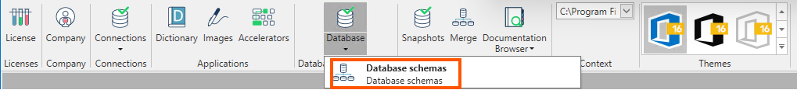
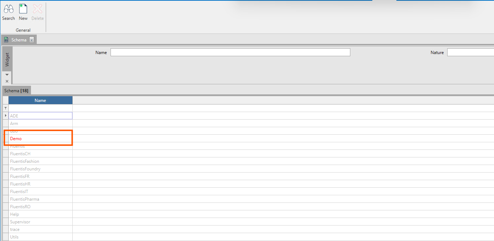

Lo schema di database definisce in che modo i dati vengono organizzati all'interno di un database relazionale; questo include vincoli logici quali nomi di tabelle, campi, tipi di dati e le relazioni tra le diverse entità.

La form **Database Schemas** è costituita da una griglia dei risultati e un ribbon menu con le azioni contestuali consentite all'utente di Fluentis.

### Filtro
* **Name**: Indica il nome dello schema del database.
* **Nature: Indica se lo schema è custom o presente a standard.

### Griglia dei risultati
* **Name:** codice che rappresenta lo schema del database.  

### Azioni
* **Ricerca:** per ricercare secondo i filtri impostati la lista degli schemi disponibili.
* **Nuovo:** per creare un nuovo schema.
* **Cancella:** per cancellare lo schema selezionato.
* **Schema di applicazioni:** apre la form **Schema di applicazioni**.
* **Stampa:** insieme standard delle funzioni di stampa con combobox di selezione, anteprima e stampa.

E' possibile inoltre creare degli schemi di database custom, che verranno evidenziati in rosso.  
Questa operazione è necessaria qualora si decida di creare oggetti custom (ad esempio basati su estensione di oggetti standard) il quale devono essere necessariamente mappati su uno schema database custom.

