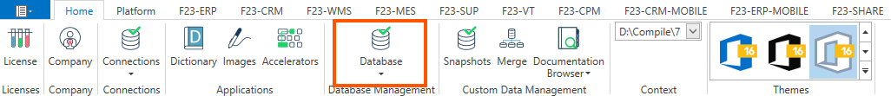
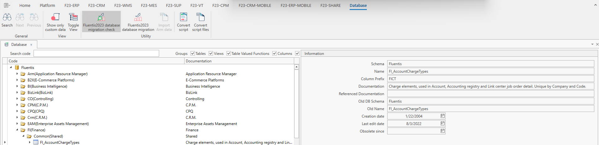

Tramite il pulsante Database è possibile visualizzare la struttura logica della base dati Fluentis.  
Tale struttura è suddivisa per aree funzionali, e all'interno di ogni nodo è possibile visualizzare le tabelle associate a ciascuna area.
La form si compone di:

* un ribbon menu;
* un filter form;
* un filter result;
* un tab di destra contente delle informazioni sulla tabella selezionata.

Per i dettagli delle operazioni possibili tramite click del tasto destro sui diversi elementi si rimanda all'apposita sezione [Menu contestuale](menuContestuale).

### Filter form
* **Codice Ricerca:** parola chiave da ricercare (utilizzare _%_ per la ricerca in like).
* **Gruppi:** togliere il flag per escludere i Gruppi dalla ricerca.
* **Tabelle:** togliere il flag per escludere le Tabelle dalla ricerca.
* **Colonne:** togliere il flag per escludere le Colonne dalla ricerca.

### Filter Result
* **Codice:** nome della tabella;
* **Documentazione:** descrizione semplificata del contenuto della tabella.
Espandendo il contenuto delle cartelle si possono visualizzare le tabelle MSSQL che compongono quella determinata area.  

Sulla destra, il tab **Informazioni** visualizza informazioni relative alla tabella selezionata.

### Ribbon menu _Generale_
* **Ricerca:** per ricercare secondo i filtri impostati la lista degli elementi disponibili.
* **Successivo:** per passare all'elemento successivo dei risultati della ricerca.
* **Precedente:** per tornare all'elemento precedente dei risultati della ricerca.

### Ribbon menu _Visualizza_
* **Mostra solo dati personalizzati:** per filtrare solo dati personalizzati.
* **Alterna View:** per resettare allo stato di visualizzazione iniziale.

### Ribbon menu _Utilità_
* **Verifica migrazione database a Fluentis2023:** consente di verificare la migrazione di database da versione 2021 a 2023.
Dovranno essere inseriti i seguenti dati e un messaggio di conferma comunicherà che il database ha superato il test, quindi potrà essere migrato a F2021.

* **Migrazione database a Fluentis2023:** consente l'effettiva migrazione di database da versione 2021 a 2023.
Dovranno essere inseriti i seguenti dati e un messaggio di conferma comunicherà che il database ha superato il test, quindi potrà essere migrato a F2023.

* Server: Istanza del Server MSSQL dove è presente il DB da migrare (DB di origine).
* Database: Nome del database presente nell'istanza MSSQL di cui al punto che precede.  
* Operatore: Si tratta dell'utente che accede all'instanza MSSQL (utente sa - SuperAdmin).
* Password : Si tratta della password dell'utente sa - SuperAdmin.

Nel tab (Destination Database) i dati da inserire sono speculari al tab di cui al punto che precede, con 

* **Importa dati Arm:** Consente di importare dati in Arm direttamente da un'altro database. Sempre disabilitato per l'utente.

* **Convertire script:** converte una query F2021 in F2023.
Inserire la query nel riquadro di sinistra, successivamente premere il bottone evidenziato e la query risulterà nel riquadro di destra.

* **Convert script file:** converte un file sql F2015 o F2021 in un file F2023. 
Selezionare il file da convertire ed attendere qualche secondo, successivamente scegliere la posizione di destinazione del disco per lo script convertito.

Per quanto concerne la procedura di migrazione si rimanda ad appositi documentazione e training dedicati.   

