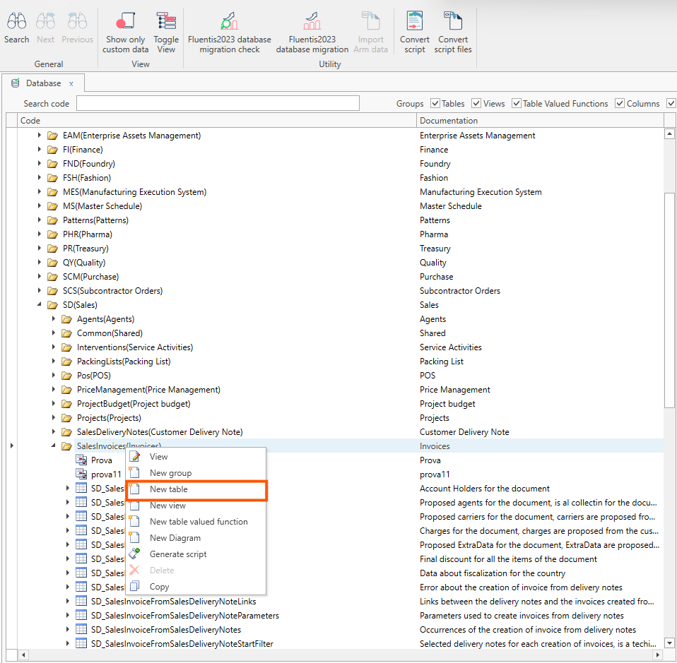
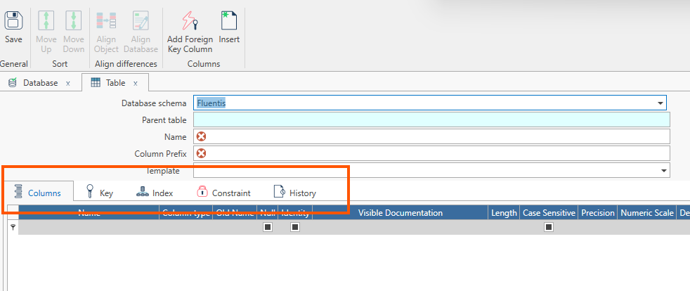
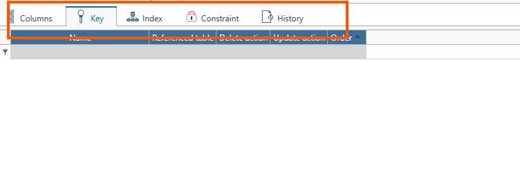

Sempre nella form principale **Database**, premendo il tasto dx del mouse, è possibile creare delle nuove tabelle nel database di **Fluentis**.  

Nella form, sono presenti le generalità che identificano la nuova tabella:
* Schema del database, che sarà uno scherma **custom**.  
* Parent table.
* Nome.
* Prefisso delle colonne (popolato automaticamente dal sistema).
* Template, permette di scegliere un template di tabella tra quelli a disposizione nel sistema.
* Old DB Schema.
* Old Name.
* Obsolete Since, con date picker.

Nel tab centrale si trovano:
* Colonne, che fa riferimento alla definizione delle colonne della tabella.  
* Chiave, che fa riferimento alla chiave primaria della tabella.  
* Index, che fa riferimento ad evenuali indici della tabella, se definiti.  
* Constraint, che fa rifemento ai vincoli di chiave esterna della tabella (foreign key).

