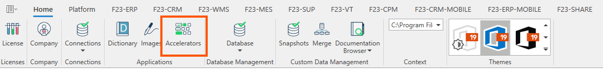
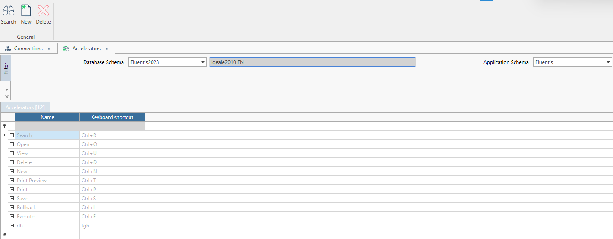

## Accelerators

Gli **Accelleratori** sono una funzionalità che permette di settare delle scorciatoie da tastiera (shortcut) per eseguire alcune azioni comuni, come per esempio la ricerca dei record su una form.   

La form si compone di:

* un **filtro standard** composto da:
* Database Schema: che indica lo schema del database selezionato.
* Application Schema che indica il prefisso delle tabelle.

* un **corpo centrale** composto da:
* Name: Nome del comando.
* Keyboard shortcut: si tratta della combinazione di tasti associata al comando.

Per esempio aprendo una form e premendo la combinazione di tasti CTRL + R eseguiamo la ricerca dei record della form.

