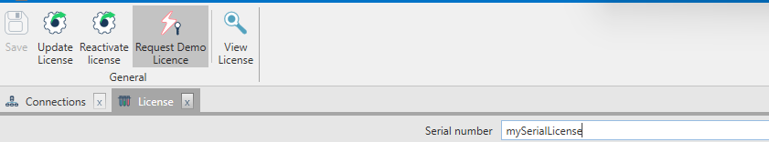

La form contiene tutte le informazioni della licenza acquistata dal cliente.

La form **Licenza** è costituita da un corpo centrale che mostra il numero seriale e una ribbon bar con le azione consentite all'utente.

**Corpo centrale**
* **Numero seriale:** è il numero seriale della licenza che è stata associata al cliente, ed è univoco.

**Azioni**
* **Salva:** permette di salvare il numero seriale della licenza, questo da modo poi di configurare gli ambienti associati alla licenza e per ogni ambiente le applicazioni collegate.
* **Aggiorna la licenza :** da utilizzare in seguito a
    - un cambio del codice licenza;
    - un cambio del numero di utenti collegato alla licenza;
    - chiusura di un ticket lato Fluentis in seguito a una aggiunta di una nuova Società.
* **Riattivare la licenza:** <!--modifiche alla struttura hardware del server invalidano la licenza che blocca l'esecuzione dell'applicativo. Per poter riattivare la licenza è necessario inserire un codice fornito da Fluentis.-->
* **Richiesta licenza demo:** procedura per richiedere una licenza demo a scopi commerciali. Questa richiesta può essere fatta aprendo un ticket direttamente a Fluentis.
* **Visualizza licenza:** permette di visualizzare tutti i dettagli relativi alla licenza rilasciata al cliente.

