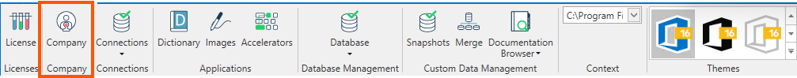
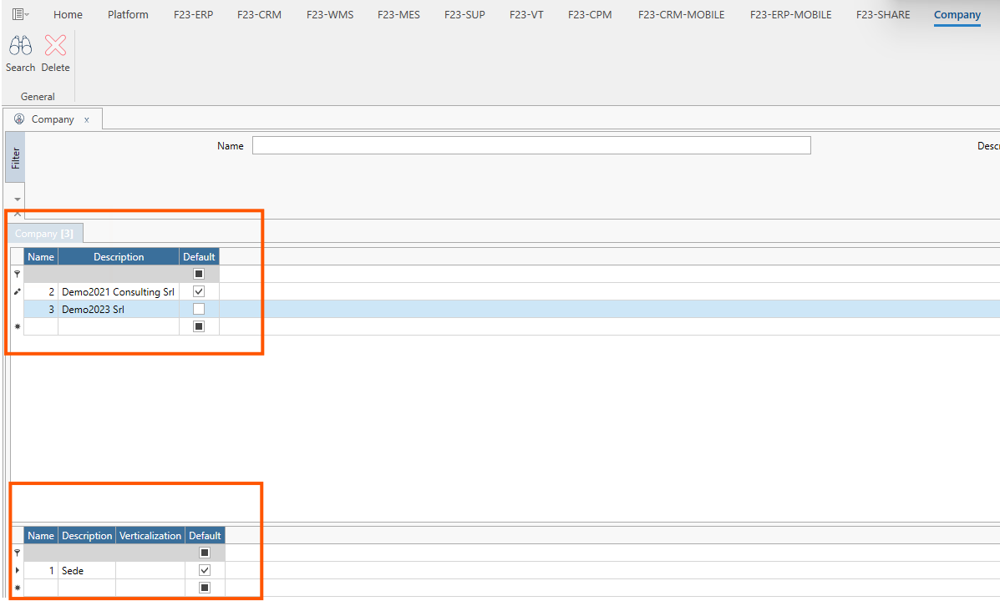

Il medesimo sistema gestionale Fluentis permette di lavorare con più **Società**, ognuna della quale avrà n. **Divisioni**.
La tabella a database dove vengono salvate le società è denominata Fluentis.SH_Companies ed è presente sul DB Fluentis caricato sull'istanza MSSQL dedicata alla suite.  
Di default Società e Divisione sono impostate con quanto specificato in sede d'installazione di Fluentis Live Update.

La form si compone così come segue.   

**Filtro**
* **Nome**
* **Descrizione**

**Griglia dei risultati**
* **Nome:** Codice numerico identificativo della Società.
* **Descrizione:** Denominazione / Ragione Sociale.
* **Predefinito:** Checkbox che identifica il caricamento di default di tale Società all'avvio di Fluentis.

Le informazioni rappresentate in griglia relativamente ad ogni società, sono ulteriormente dettagliate attraverso la griglia inferiore che visualizza l’elenco delle divisioni per ciascuna Società.  

* **Nome:** Codice numerico identificativo della divisione.
* **Descrizione:** Descrizione della divisione.
* **Predefinito:** Checkbox che identifica la divisione di default per la società.

**Azioni**
* **Ricerca:** per applicare le regole di filtro e caricare la lista delle società disponibili.
* **Elimina:** per eliminare la società selezionata.

