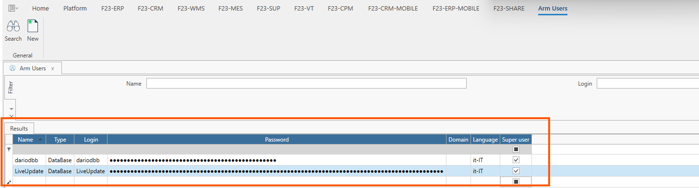
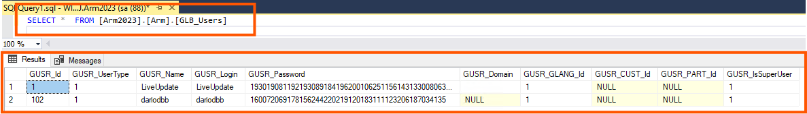

La form Utenti Arm permette di parametrizzare gli utenti che avranno accesso all'Application Resource Manager, ed eventualmente attribuire all'utente i diritti di SuperUser.  
Le informazioni relative al nome utente e password vengono salvate nel Database di ARM come in figura sottostante (con password cifrata).

La form si compone di un filtro, una griglia dei risultati e una ribbon bar con le azioni a disposizione degli utenti.

**Filtro**
* **Nome**
* **Login**

**Griglia dei risultati**
* **Nome:** stringa alfanumerica identificativa dell’utente.
* **Tipo:** tipologia di autenticazione utente:
    - **Active Directory:** quando l’autenticazione è di Dominio/Workgroup
    - **Database:** quando l’autenticazione viene gestita interamente da ARM.
* **Login:** login dell’utente.
* **Password:** password del login. Da utilizzare solo se User Type è impostato su Database.
* **Dominio:** nome del dominio di autenticazione dell’utente o nome del workgroup del server di ARM.
* **Lingua:** lingua predefinita per l’utente.
* **Super user:** identifica se l’utente ha diritti di amministratore.

**Azioni**
* **Ricerca:** per applicare le regole di filtro e caricare la lista degli utenti Arm disponibili.
* **Nuovo:** per inserire un nuovo utente.

