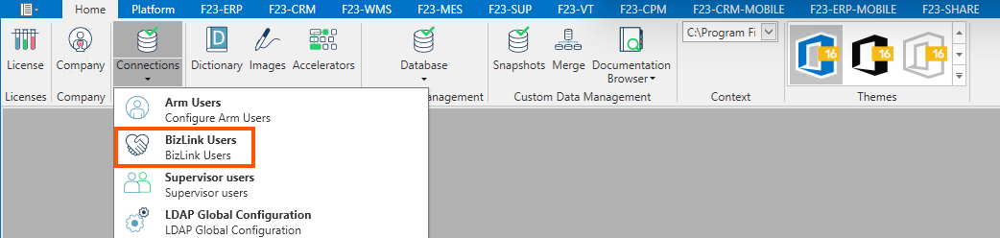

](../../../../../static/images/20241129095329.png)

In questa form è possibile parametrizzare gli utenti che dovranno avere accesso all'applicativo BizLink.
Nel tab di sinistra, per ciascun utente è possibile definire **Nome**, **Password**, e un flag che se impostato su true indica che l'utente è disabilitato.  
Nel tab di destra si trovano le connessioni associate allo specifico server Arm in uso. Attraverso il flag 'Is active' è possibile abilitare l'utente selezionato nel tab di sinistra con la specifica connessione.  
Associando lo specifico utente alla connessione si abilita lo stesso all'utilizzo del servizio di BizLink per quella specifica connessione.  

