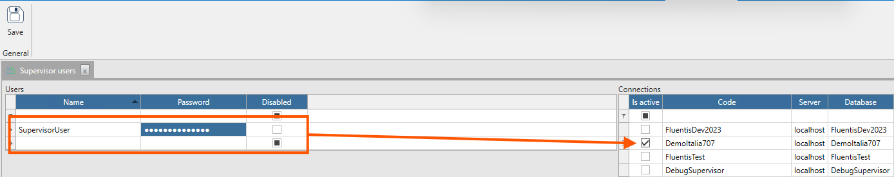

In questa form è possibile parametrizzare gli utenti che dovranno l'accesso al servizio di Supervisor.  
Nel tab di sinistra, per ciascun utente è possibile definire **Nome**, **Password**, e un flag che se impostato su true indica che l'utente è abilitato.  
Nel tab di destra si trovano le connessioni associate allo specifico server Arm in uso. Attraverso il flag 'Is active' è possibile abilitare l'utente selezionato nel tab di sinistra con la specifica connessione.  
Infine, il pulsante **Salva** permette di salvare la parametrizzazione effettuata.

