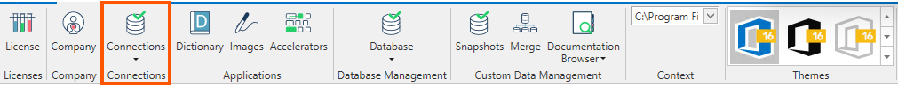
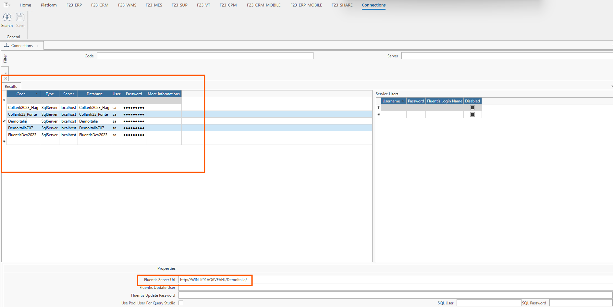

In questo gruppo vengono mostrati i parametri di connessione all'istanza MSSQL dedicata alla suite Fluentis che comprende i database di FluentisLiveUpdate, Arm e FluentisErp.     
A questi database verranno poi definiti gli accessi alle varie applicazioni e moduli che compongono il sistema gestionale.

La form **Connessioni** è costituita da un filtro, un corpo centrale con griglia dei risultati sulla destra e griglia di dettagli sulla destra e una serie di informazioni valide per ogni dettaglio selezionato, poste in un expander in coda alla form e una ribbon bar con le azione a disposizione dell'utente.

**Filtro**
* **Codice**
* **Server**

**Griglia dei risultati**
* **Codice:** codice alfanumerico univoco da assegnare alla connessione.
* **Server:** nome dell’istanza MSSQL dedicata alla suite Fluentis.
* **Database:** nome del database caricato sull'istanza MSSQL.
* **Utente:** utente sa (SuperAdmin).
* **Password:** password dell'utente sa (SuperAdmin).

Oltre alla griglia dei risultati, sulla sinistra, è presente una griglia di dettaglio **Service Users**, utile per effettuare chiamate WCF all'esterno di Fluentis. Per esempio è possibile utilizzare i Service Users per loggarsi su eventuali server stampa esterni o quando si chiamano delle Web API che necessitano un'utenza.
* **Nome utente**
* **Password**
* **Nome login Fluentis**
* **Disabilitato**

L'expander finale **Proprietà** contiene una serie di proprietà aggiuntive per ogni record di connessione che viene selezionato, in particolare:
* **Fluentis Server Url:** si tratta dell'endpoint relativo al cluster di Fluentis utilizzato per la connessione. 
* **Utente Aggiornamento Fluentis:** nome utente da utilizzare per aggiornare l’applicativo.
* **Password Aggiornamento Fluentis:** password associata all’utente per autorizzare aggiornamento.
* **Usa utente del pool per Query Studio:** Se questo flag è ‘True’, le query verranno eseguite utilizzando la stessa connection string come Fluentis (utente sql/password definite nella riga della connessione).
* **Utente SQL:** utente utilizzato da Fluentis per eseguire le query su DB MSSQL.
* **Password SQL:** password dell’utente MSSQL utilizzato da Fluentis per eseguire le query.

**Azioni**
* **Ricerca:** per applicare le regole di filtro e caricare la lista delle connessioni disponibili.
* **Salva:** per salvare tutte le modifiche effettuate.

