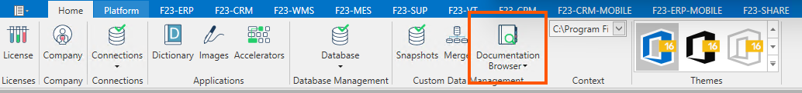
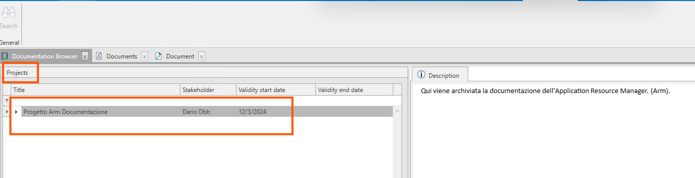

La funzionalità Documentation Browser messa a disposizone su Arm, permette all'utente di archiviare al'interno di Fluentis una documentazione composta da parti scritte ed allegati, utile per l'utente che ha così un punto di riferimento nell'utilizzo del gestionale.  

A livello logico, l'intera documentazione è organizzata secondo una gerarchia specifica:  
* Progetti;
    * Articoli;
        * Documenti.

I  documenti, che compongono nel loro complesso la documentazione dovranno quindi fare riferimento ad un **Articolo** e quest'ultimo ad un **Progetto**. 
Per ogni **progetto** (possono) esistere più **articoli**, e per ogni articolo più **documenti**.  
Il primo passo sarà quindi creare un Progetto, per poi creare i relativi articoli e documenti.

