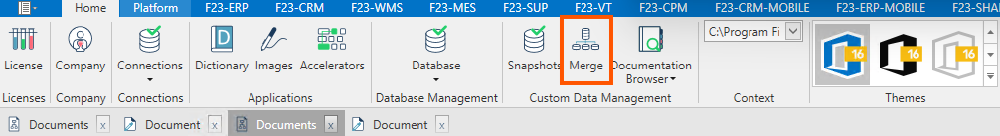
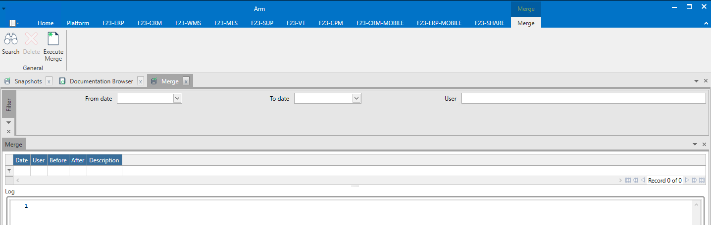
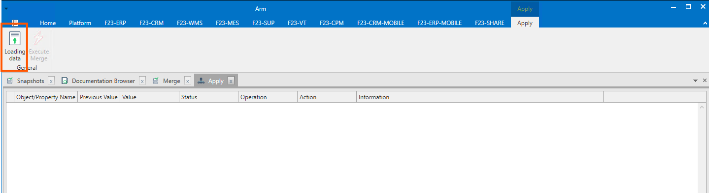
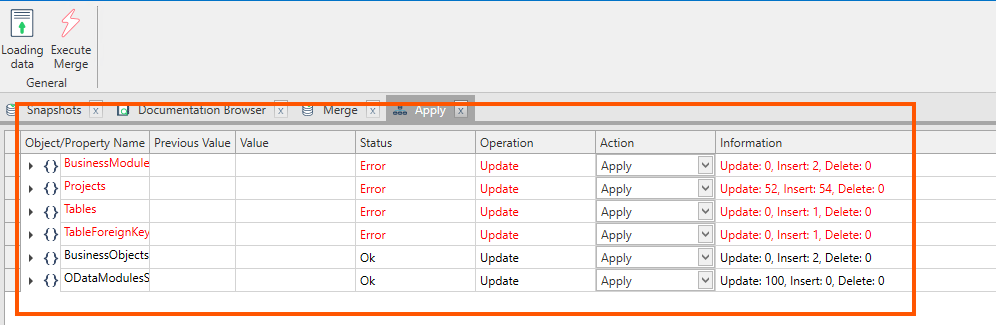

Il Merge è il processo di combinare più insiemi di dati in uno solo ed è fondamentale al fine di integrare gli sviluppi preservando coerenza ed ordine.

Questa form contiene la lista di tutti i merge eseguiti e permette di eseguirne uno nuovo che consiste nel caricare il file delle differenze creato tramite la funzione degli snapshot e visualizzare i risultati generati dalla sua applicazione.  

La form permette di visualizzare eventuali conflitti, errori o record duplicati che si andrebbero a generare eseguendo tutti gli script di migrazione. Permette inoltre di gestire in modo manuale tutte le modifiche, scegliendo se applicare o saltare ogni insert/update/delete.

La form **Merge** è una filter form composta da un filtro, una griglia dei risultati e una ribbon bar con le azione consentite all'utente.

### Filtro standard

* **Da data / A data:** per filtrare i merge effettuati in un preciso intervallo temporale.
* **User:** per filtrare i merge effettuati da uno specifico utente.

### Griglia dei risultati

* **Data:** data in cui è stato effettuato il merge.
* **Operatore:** utente connesso ad Arm che ha effettuato il merge.
* **Prima del / Dopo del:** intervallo temporale in cui è stato eseguito il merge.
* **Descrizione:** descrizione inserita in fase di creazione.

### Ribbon menu

* **Ricerca:** per applicare le regole di filtro e caricare la lista dei merge disponibili.
* **Cancella:** per eliminare lo snapshot selezionato.
* **Execute Merge:** apre un nuovo tab **Applica** che permette di applicare il file delle differenze generato tramite snapshots.

Il tab **Applica** è costituito da un griglia dei risultati che si popola in automatico al caricamento di un file delle differenze (attraverso l'apposito tasto Caricamento dati) mostrando il risultato delle operazioni di singoli script prima che questi vengano realmente applicati e da una ribbon bar con le azione consentite all'utente.

### Griglia dei risultati

* **Nome oggetto/proprietà:** oggetto di arm che si cercando di modificare.
* **Valore precedente:** contiene il valore del file originale
* **Value:** contiene il valore del file che volgiamo andare a caricare.
* **Status:** lo stato indica lo stato dell'operazione che vogliamo compiere è vanno verificare tutti i record con stato Error/Conflict.
* **Operation:** Update/Insert/Delete.
* **Action:** Apply/Skip.
* **Informazioni:** dettagli descrittivi sulle operazioni che verranno compiute su ogni singolo modulo.

### Funzionalità 

* **Caricamento dati:** permette di selezionare il file delle differenze che vogliamo applicare e simulare il merge e validarne i risultati.

* **Execute Merge:** permette di eseguire concretamente il merge dopo averne validato il risultato e inserita una descrizione.

