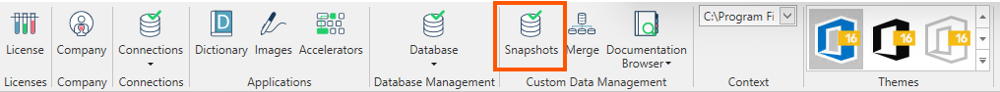
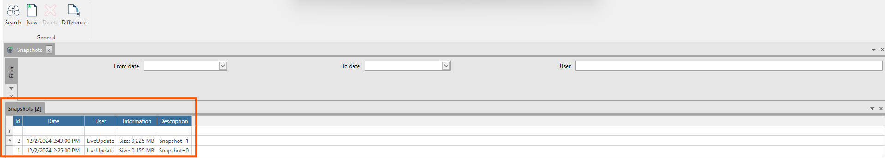

### Introduzione

In questo sottogruppo si trovano tutti i comandi necessari per eseguire uno snapshot della base di dati.  
Lo snapshot è una *fotografia* della base dati in un determinato istante temporale, e confrontando due snapshot ottenuti in due epoche diverse è possibile generare uno script Sql
che per differenza, una volta applicato sulla base dati di destinazione, consentirà di spostare le personalizzazioni dall'ambiente di sviluppo a quello di produzione.  

### Form

La form **Snapshots** è una filter form con un filtro, una griglia dei risultati e una ribbon bar con le azioni consentite all'utente.

**Filtro**
* **Da data/A data:** per filtrare gli snapshot effettuati in un preciso intervallo temporale.
* **User:** per filtrare gli snapshot effettuati da uno specifico utente.

**Griglia dei risultati**
* **Id:** identificativo univoco dello snapshot.
* **Data:** data in cui è stato effettuato.
* **Operatore:** utente connesso ad Arm che ha effettuato lo snapshot.
* **Informazioni:** dettagli aggiuntivi che descrivono la dimensione dello snapshot.
* **Descrizione:** descrizione inserita in fase di creazione.

**Azioni**
* **Ricerca:** per applicare le regole di filtro e caricare la lista degli snapshot disponibili.
* **Nuovo:** per creare un nuovo snapshot.
* **Cancella:** per eliminare lo snapshot selezionato.
* **Differenza:** apre un popup che permette di selezionare 2 snapshot per generare il file diff contenente gli script che consentiranno di migrare le modifiche fatte.

### Ribbon menu

Il pulsante **Nuovo** apre un popup che permette di inserire la descrizione dello snapshot che si sta andando a creare, le restanti informazioni verranno inserite in automatico.  

Il pulsante **Differenza** apre un popup che permettere di selezionare lo snapshot inziale e lo snapshot finale, ovvero i 2 intervalli temporali che devono essere contenute nel file delle differenze. Il file delle differenze è un file zip autogenerato che contiene tutti gli script necessari a migrare le modifiche fatte tra i 2 snapshot selezionati.  

E' possibile anche selezionare gli snapshot al contrario per ripristinare una situazione precedente che è stata alterata in modo errato.

