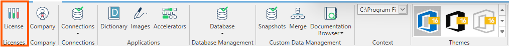
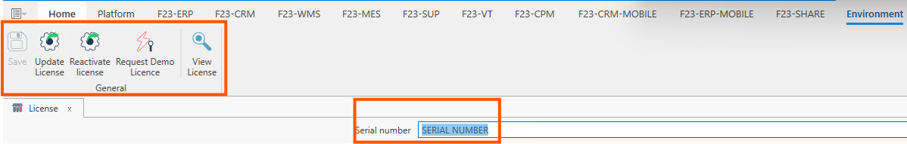
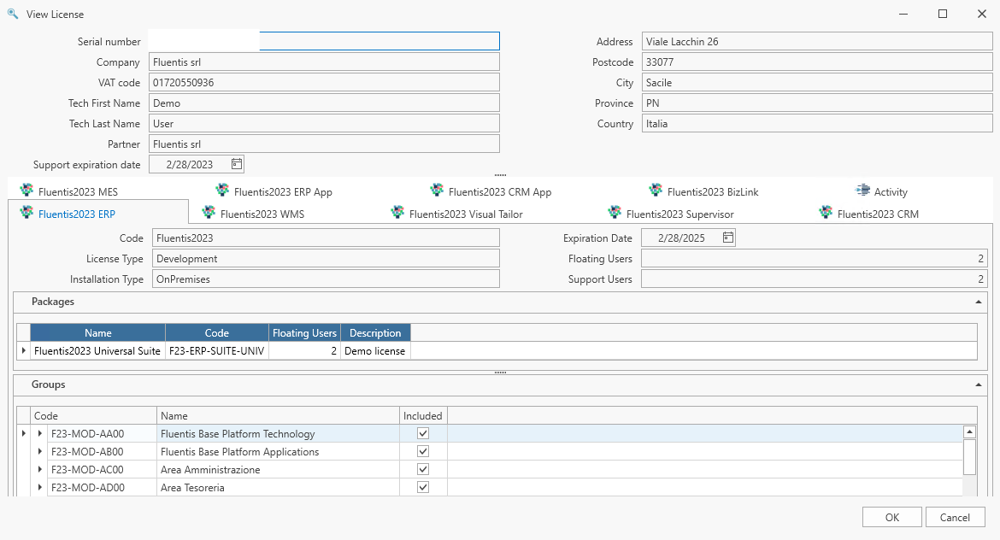

La licenza è un codice alfanumerico univoco fornito al committente di Fluentis S.r.l. che da diritto ad esso di utilizzare il gestionale in funzione dei moduli acquistati in fase di trattativa commerciale. (Es. ERP, CRM, WMS...).

La form **Licenza** è costituita da un corpo centrale che mostra il numero seriale e una ribbon bar con le azione consentite all'utente.

**Corpo centrale**
* **Numero seriale:** è il numero seriale alfanumerico della licenza che è stata associata al cliente, ed è univoco.

**Azioni**
* **Salva:** permette di salvare il numero seriale della licenza, questo da modo poi di configurare gli ambienti associati alla licenza e per ogni ambiente le applicazioni collegate.
* **Aggiorna la licenza :** da utilizzare in seguito a
    - un cambio del codice licenza;
    - un cambio del numero di utenti collegato alla licenza;
    - chiusura di un ticket lato Fluentis in seguito a una aggiunta di una nuova Società.
* **Riattivare la licenza:** Attualmente la voce non è attiva.  
* **Richiesta licenza demo:** Attualmente la voce non è attiva.  
* **Visualizza licenza:** permette di visualizzare tutti i dettagli relativi alla licenza rilasciata al cliente. Questi dettagli fanno riferimento a:
    -   Dati societari.
    -   Moduli che compongono il sistema gestionale (CRM, ERP, WMS, MES,...).
    -   Dettaglio relativo ai moduli selezionati.

