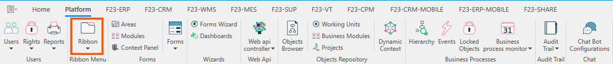
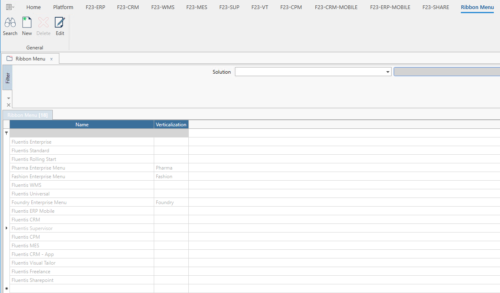
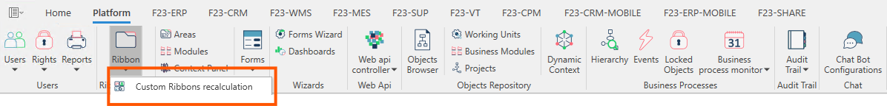
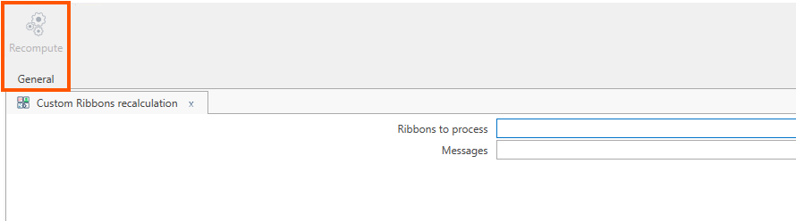

Come già detto in precedenza il **Ribbon menu** è il menu contestuale presente in testata in ciascuna form Fluentis.  
In questa sezione approfondiamo le funzionalità legate alla personalizzazione dei **Ribbon menu** direttamente dall'Application Resource Manager (Arm).  

La form principale si presenta con:
* Un ribbon menu contestuale alla form che consente all'utente di effettuare le consuete azioni **Search**, **New**, **Delete**, **Edit**.
* Un filtro standard, che permette di filtrare per **Solution**.
* Una griglia dei risultati.

Nella griglia dei risultati, tramite il pulsante **New**, è possibile aggiungere degli elementi **custom**.  

Premendo invece sul dropdown, si abilita la funzione di ricalcolo del **Ribbon menu** che permette di rendere effettive le modidiche circa gli elementi custom aggiuntivi.  

Tramite il pulsante evidenziato in arancione è possibile  ricalcolare il **Ribbon Menu**. per includere elementi custom.  
E' consigliabile eseguire questa operazione ogni qualvolta si includano uno o più elementi custom all'interno del **Ribon menu**, per esempio l'aggiunta di un nuovo pulsante.   

