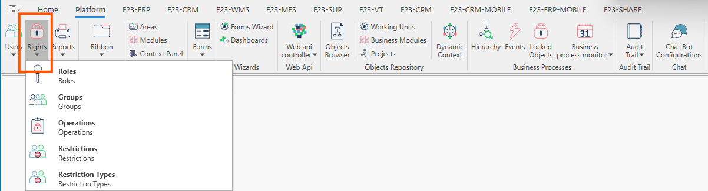
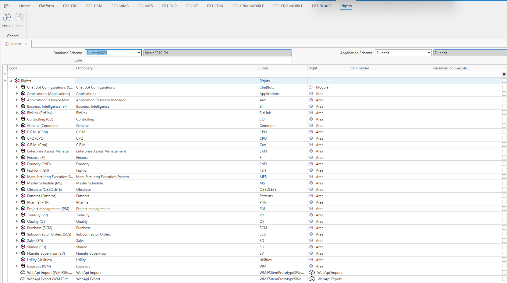

Nell'Gestione Fluentis ERP i **diritti** fanno riferimento alla possibilità per l'utente di compiere una determinata azione definita in uno specifico ruolo.  
La form principale dei diritti si compone così come segue:

* Un filter form standard con cui è possibile filtrare per code e schema di applicazioni.
* Una griglia dei risultati che illustra all'utente tutti i moduli suddivisi per aree gestionali (amministrazione, produzione logistica, ecc...).

Espandendo ciascun nodo l'utente può prendere visione dei diritti ad esso associati.  

