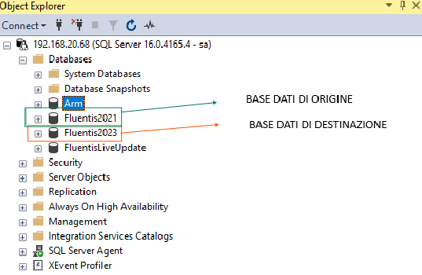

## Overview

Il processo di Migrazione consente all'utente di Fluentis di passare da una **Major Release** di origine ad una di destinazione mantenendo inalterata la base dati di **Fluentis**, tutte le parametrizzazioni e personalizzazioni effettuate. 
entro alcuni limiti strutturali dettagliati nel proseguo di questa documentazione tecnica dedicata.   
I vantaggi che riguardando il passaggio ad una **Major Release** più recente di **Fluentis** sono un maggiore supporto adi aggiornamenti rilasciati in termini di release e di **patch**, oltre alla disposizione di nuove funzionalità.  

Si precisa che la migrazione di un ambiente Fluentis può avvenire solo e soltanto tra due **Major Release** contigue tra loro. Per esempio posso passare da Fluentis 2015 a Fluentis 2021 oppure da Fluentis 2021 a Fluentis 2023, ma non direttamente da Fluentis 2015 a Fluentis 2023.   

Per effettuare correttamente la **Migrazione**, occorre osservare alcune particolarità che sono fondamentali.  
***Di seguito definiamo:***  
* L'ambiente da migrare (cosiddetto ambiente di origine), deve essere allineato all'ultima release e patch per quella determinata major release.   
* L'ambiente da utilizzare come **'ponte'** per la migrazione deve essere aggiornato all'ultima release e patch per la major release dell'ambiente di destinazione.   
* L'ambiente di destinazione come l'ambiente basato sulla base di dati (Fluentis) migrata, cioè quella di destinazione.  

  
*database di origine e di destinazione a seguito del processo di migrazione.*

Dunque, ricapitolando, il processo di migrazione prevede di utilizzare un ambiente totalmente standard che fungerà da template per poter ottenere la base dati di destinazione da quella di origine.  
Vedremo nella seguente documentazione ogni aspetto fondamentale riguardante la **Migrazione**.  

