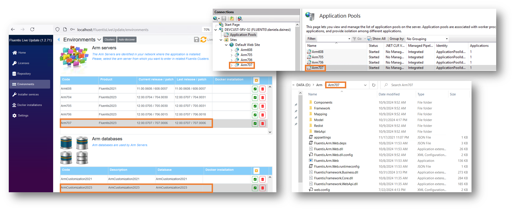

L'Application Resource Manager, di seguito anche 'Arm', è un'applicativo facente parte della Suite Fluentis, e si tratta del principale strumento amministrativo di Fluentis ERP.  

Arm consente infatti sia la configurazione e la parametrizzazione degli utenti a livello di ruoli, diritti, restrizioni, operazioni sia le personalizzazioni tram,ite il codice custom.  
L'applicativo Arm non è personalizzabile e/o modificabile dagli utenti, e ogni eventuale modifica dell'applicativo verrà distribuita da Fluentis S.r.l. tramite Release o patch che potranno essere installate tramite il Fluentis Live Update.  

L'applicativo Arm è composto da:

* un database 'Arm' dedicato e caricata sull'istanza MSSQL dedicata alla suite Fluentis.  
* una cartella di pubblicazione (cartella di deploy) contenente tutte le dll.
* un Application Pool dedicato con relativa app sul Web server IIS. (Nel caso di installazioni su Linux con Docker un container dedicato).
* un Client per poter accedere ad Arm.

